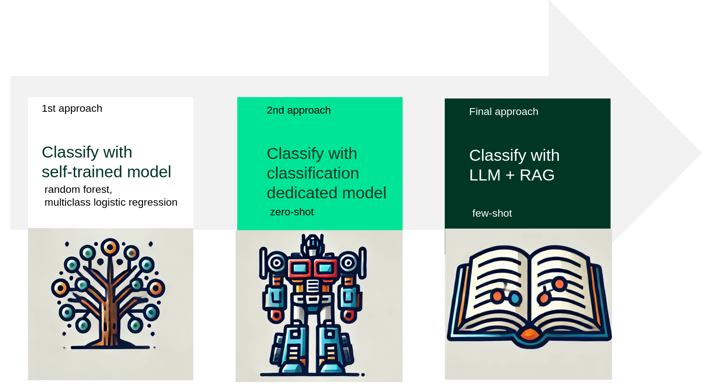

# Text classification into industry categories

The goal of this projest is to present 2 different approaches for text classification. 
Company descriptions are classified into 1835 industry codes from official german classification [WZ 2008](https://www.destatis.de/DE/Methoden/Klassifikationen/Gueter-Wirtschaftsklassifikationen/Downloads/klassifikation-wz-2008-3100100089004-aktuell.pdf?__blob=publicationFile). 
Complete description of the task and used approaches can be found in [this article](https://medium.com/@michalzarnecki88/classifying-unstructured-text-into-1800-industry-categories-with-llm-and-rag-d5fe4876841f).

## Approach with LLM (Large Language Model) + RAG (Retrieval Augmented Generation)

Project shows classification of text with OpenAI GPT-4 model accessed via API.
To improve classification results prompt is enriched by additional guidelines text accessed with RAG (Retrieval Augmented Generation) is used. 

[classify-industry-with-LLM-and-RAG.ipynb](classify-industry-with-LLM-and-RAG.ipynb)

## Approach with zero-shot transformer classification dedicated model
Sample classification using model MoritzLaurer/mDeBERTa-v3-base-mnli-xnli downloaded from HuggingFace.
 
[[classify-industry-with-self-train-model.ipynb](classify-industry-with-self-train-model.ipynb)](https://github.com/mzarnecki/companyDescriptionClassification/blob/master/classify-industry-with-zero-shot-tranformer.ipynb)

## Approach with self trained model - RandomForestClassifier
Project contains text normalization, tokenization, model training and evaluation as well as model export and import. 
Presented approaches were used to classify company descriptions from [data/data.csv](data/data.csv) into 2 industry categories. 

[classify-industry-with-self-train-model.ipynb](classify-industry-with-self-train-model.ipynb)

In order to use these examples in your classification problems just replace datasets.
